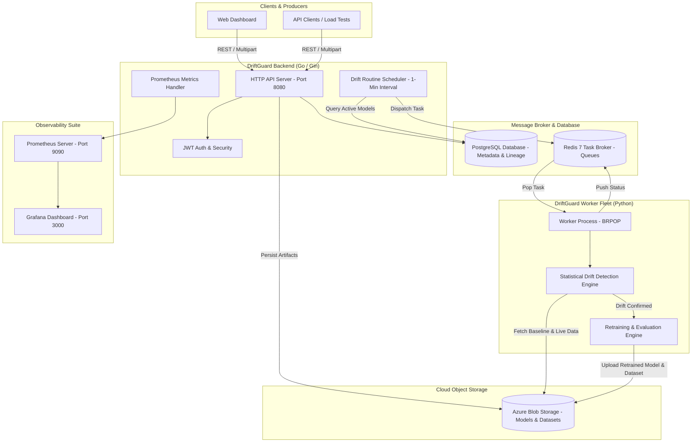

# DriftGuard 🛡️

[](https://golang.org)
[](https://python.org)
[](https://www.docker.com)
[](https://kubernetes.io)
[](https://redis.io)
[](https://www.postgresql.org)
[](https://azure.microsoft.com)
[](https://prometheus.io)

**DriftGuard** is an automated, cloud-native MLOps monitoring and autonomous retraining engine. It continuously tracks data distribution changes in production machine learning models, quantifies statistical covariate shift and concept drift across numerical and categorical features, and automatically retrains and re-versions models without manual intervention.

---

## 📑 Table of Contents

- [Overview & Key Problems Solved](#-overview--key-problems-solved)
- [Key Features](#-key-features)
- [System Architecture](#-system-architecture)
- [Statistical Drift Detection Suite](#-statistical-drift-detection-suite)
- [Repository Structure](#-repository-structure)
- [Prerequisites & Environment Variables](#-prerequisites--environment-variables)
- [Getting Started](#-getting-started)
  - [Option 1: Quickstart with Docker Compose (Recommended)](#option-1-quickstart-with-docker-compose-recommended)
  - [Option 2: Local Bare-Metal Setup](#option-2-local-bare-metal-setup)
- [API Reference](#-api-reference)
- [Kubernetes & Cloud Native Deployment](#-kubernetes--cloud-native-deployment)
- [Load & Stress Testing (k6)](#-load--stress-testing-k6)
- [Monitoring & Observability](#-monitoring--observability)
- [License](#-license)

---

## 🔍 Overview & Key Problems Solved

In production machine learning systems, model decay is silent and inevitable. As real-world user behaviors, macroeconomic indicators, and sensor measurements evolve, the statistical properties of incoming features deviate from the model's training baseline (**Covariate Shift**), causing predictions to degrade silently.

**DriftGuard** bridges the gap between model deployment and continuous reliability:
1. **Continuous Baseline Auditing**: Regularly polls production models against live incoming data streams.
2. **Multi-Method Statistical Drift Analysis**: Runs complementary tests (Kolmogorov-Smirnov, PSI, Wasserstein, Chi-Square, Correlation Matrix) to eliminate false positives.
3. **Autonomous Closed-Loop Retraining**: Automatically triggers retraining, evaluates out-of-sample accuracy, increments model versions (`v1` $\rightarrow$ `v2`), and updates active production endpoints.
4. **Cloud-Native Scalability**: Decouples API ingestion, task coordination, and compute-heavy Python ML workers using Redis queues and Kubernetes Horizontal Pod Autoscaling (HPA).

---

## ⚡ Key Features

- **High-Throughput Go API**: Built with Go 1.25, Gin, and GORM with connection pooling tuned for high-concurrency cloud databases (Azure PostgreSQL).
- **Asynchronous Master-Worker Engine**: Go API dispatches jobs onto Redis queues; distributed Python workers asynchronously consume tasks and compute drift statistics.
- **Automated Retraining & Zero-Touch Deployment**: Automatically retrains scikit-learn models upon confirmed drift and persists new artifacts.
- **Automated Versioning & Lineage**: Automatically increments versions (`v1.pkl`, `v2.pkl`) and snapshots datasets (`v1.csv`, `v2.csv`) to Azure Blob Storage while tracking lineage in PostgreSQL.
- **Modern Responsive Dashboard**: Built-in web UI with dark/light mode toggle, project management, real-time status indicators, model version histories, and drag-and-drop model uploads.
- **Enterprise Security**: JWT-based authentication (HMAC-SHA256) and bcrypt salted password hashing.
- **Production Observability**: Native Prometheus `/metrics` scraping and preconfigured Grafana dashboards.
- **Stress-Tested & Scalable**: Validated with k6 load testing scripts up to 400+ concurrent Virtual Users (VUs) and auto-scaled via Kubernetes HPA.

---

## 🏗️ System Architecture



### End-to-End Workflow

1. **Model Deployment**: A user uploads a trained model (`.pkl`) and supplies a live dataset endpoint (`CSV URL`). The Go backend commits records to PostgreSQL and uploads artifacts to Azure Blob Storage under `models/` and `datasets/`.
2. **Periodic Inspection**: The Go background scheduler iterates every minute through all active deployed models and pushes inspection tasks into Redis (`drift_check_queue`).
3. **Drift Evaluation**: A Python worker pulls the task, retrieves the baseline dataset and current dataset, and executes statistical tests on every feature.
4. **Autonomous Retraining**: If data drift exceeds statistical thresholds:
   - The worker splits the updated dataset into train/test sets.
   - Retrains the model, verifies classification accuracy with scikit-learn.
   - Automatically increments the model version (`v1` $\rightarrow$ `v2`).
   - Uploads new model weights and updated reference data to Azure Blob Storage.
   - Pushes completion metadata to `results_queue`.

---

## 📊 Statistical Drift Detection Suite

DriftGuard implements a multi-faceted statistical engine located in [`worker/data_drift.py`](worker/data_drift.py):

| Statistical Test | Feature Type | Target Metrics / Thresholds | Purpose |
| :--- | :--- | :--- | :--- |
| **Kolmogorov-Smirnov (KS-Test)** | Numerical / Continuous | $p\text{-value} < 0.05$ | Non-parametric test comparing cumulative distributions of baseline vs. live data. |
| **Population Stability Index (PSI)** | Numerical / Continuous | $\text{PSI} > 0.25$ | Binned quantile divergence measuring shift severity ($\text{PSI} > 0.25$ indicates significant drift). |
| **Wasserstein Distance** | Numerical / Continuous | Absolute Earth Mover's Distance | Quantifies the minimal cost to transform one distribution into the other. |
| **Chi-Square Contingency ($\chi^2$)** | Categorical / Discrete | $p\text{-value} < 0.05$ | Evaluates frequency table differences between categorical classes. |
| **Feature Correlation Shift** | Numerical (Multi-variate) | $\Delta \text{corr} > 0.20$ | Identifies structural relationship breaks across feature pairs ($\|Corr_{ref} - Corr_{curr}\| > 0.2$). |

An overall drift condition triggers if **any** numerical feature fails the KS or PSI test, if any categorical feature fails the Chi-Square test, or if cross-feature correlation shifts exceed $0.20$.

---

## 📁 Repository Structure

```text
DriftGuard/
├── backend/
│   ├── controllers/
│   │   └── auth.go              # User registration and login handlers (bcrypt)
│   ├── database/
│   │   ├── arch.go              # GORM database schema (Users, Projects, Models, Versions)
│   │   └── db.go                # DB initialization & connection pooling configuration
│   ├── frontend/
│   │   ├── login.html           # Authentication UI (Tailwind CSS, Light/Dark mode)
│   │   └── dashboard.html       # Management UI (Model deployer, version history)
│   ├── middleware/
│   │   └── auth.go              # JWT authentication validation middleware
│   ├── models/
│   │   ├── ml_models.go         # Model deployment, storage uploads, version management
│   │   ├── projects.go          # Project workspace CRUD operations
│   │   └── userinfo.go          # Authenticated user details endpoint
│   ├── prometheus/
│   │   └── base.go              # Background performance monitor routine
│   ├── storage/
│   │   └── minio.go             # Azure Blob Storage client & upload pipeline
│   ├── tasks/
│   │   ├── assigner.go          # Active model extractor and task dispatcher
│   │   ├── redis.go             # Redis connection manager & task pusher
│   │   └── routine.go           # Periodic ticker (1-minute drift evaluation schedule)
│   ├── utils/
│   │   └── token.go             # JWT signing and claim token generation
│   └── main.go                  # Main entry point & route definitions
├── worker/
│   ├── data_drift.py            # Statistical drift algorithms (KS, PSI, Chi2, Corr)
│   ├── worker.py                # Redis worker, model runner, retrainer, Azure sync
│   ├── requirements.txt         # Python dependencies (scikit-learn, scipy, pandas, etc.)
│   ├── Dockerfile               # Worker container definition (python:3.11-slim)
│   └── iris_dataset.csv         # Sample reference dataset
├── Dockerfile                   # Multi-stage Go API container (golang:1.25 -> debian:bookworm)
├── docker-compose.yml           # Unified orchestration (API, Worker, Redis, Prometheus, Grafana)
├── apps.yaml                    # Kubernetes Deployments, Services & HPA (API & Worker)
├── infra.yaml                   # Kubernetes Infrastructure (Redis, Prometheus, Grafana)
├── prometheus.yml               # Prometheus scrape configuration
├── load-test.js                 # k6 load test: Database & Auth high-VU stress testing
├── load-test-mlops.js           # k6 load test: End-to-end model ingestion & upload testing
├── go.mod                       # Go module dependencies
├── go.sum                       # Go module checksums
└── v1.pkl                       # Sample scikit-learn model artifact
```

---

## ⚙️ Prerequisites & Environment Variables

### System Requirements
- **Docker** 24.0+ & **Docker Compose** v2+
- **Go** 1.25+ (for bare-metal backend builds)
- **Python** 3.11+ (for bare-metal worker execution)
- **PostgreSQL** 15+
- **Redis** 7+
- **Azure Storage Account** (Blob container permissions for `models` and `datasets`)

### Environment Variables

Configure these variables via a `.env` file or export them directly in your shell/Kubernetes secret:

| Variable | Default (Local) | Description |
| :--- | :--- | :--- |
| `DB_HOST` | `localhost` | PostgreSQL host address |
| `DB_PORT` | `5432` | PostgreSQL port |
| `DB_USER` | `myuser` | Database username |
| `DB_PASSWORD` | `mypassword` | Database password |
| `DB_NAME` | `myapp` | Database name |
| `REDIS_HOST` | `localhost` / `redis` | Redis server hostname |
| `REDIS_PORT` | `6379` | Redis server port |
| `AZURE_STORAGE_ACCOUNT` | *Required* | Azure Storage Account name |
| `AZURE_STORAGE_KEY` | *Required* | Azure Storage Account access key |
| `JWT_SECRET` | `my-default-secret` | Signing secret for authentication tokens |

> [!NOTE]
> Ensure containers named `models` and `datasets` exist in your Azure Blob Storage account before running uploads.

---

## 🚀 Getting Started

### Option 1: Quickstart with Docker Compose (Recommended)

1. **Clone the repository:**
   ```bash
   git clone https://github.com/Ramana-Raja/DriftGuard.git
   cd DriftGuard
   ```

2. **Supply your Azure Storage credentials in `docker-compose.yml` (or through environment variables):**
   ```yaml
   environment:
     AZURE_STORAGE_ACCOUNT: "your_storage_account"
     AZURE_STORAGE_KEY: "your_storage_key"
     DB_HOST: "your_postgres_host"
     DB_USER: "your_db_user"
     DB_PASSWORD: "your_db_password"
     DB_NAME: "your_db_name"
   ```

3. **Start all services:**
   ```bash
   docker compose up --build -d
   ```

4. **Verify running containers:**
   ```bash
   docker compose ps
   ```

5. **Access the platform:**
   - **Web UI**: [http://localhost:8080/login](http://localhost:8080/login)
   - **Metrics**: [http://localhost:8080/metrics](http://localhost:8080/metrics)
   - **Prometheus UI**: [http://localhost:9090](http://localhost:9090)
   - **Grafana Dashboard**: [http://localhost:3000](http://localhost:3000) (default credentials: `admin` / `admin`)

---

### Option 2: Local Bare-Metal Setup

#### 1. Start Prerequisites
Ensure PostgreSQL and Redis are running locally on their default ports (`5432` and `6379`).

#### 2. Run the Go API Backend
```bash
# Export configuration
export DB_HOST="localhost"
export DB_PORT="5432"
export DB_USER="postgres"
export DB_PASSWORD="yourpassword"
export DB_NAME="driftguard"
export REDIS_HOST="localhost"
export AZURE_STORAGE_ACCOUNT="your_account"
export AZURE_STORAGE_KEY="your_key"

# Download dependencies and start server
go mod download
go run backend/main.go
```
The server will start listening on port `:8080`.

#### 3. Run the Python ML Worker
```bash
cd worker

# Create virtual environment
python -m venv .venv
source .venv/bin/activate   # On Windows: .venv\Scripts\activate

# Install dependencies
pip install -r requirements.txt

# Export storage and broker credentials
export REDIS_HOST="localhost"
export AZURE_STORAGE_ACCOUNT="your_account"
export AZURE_STORAGE_KEY="your_key"

# Start the worker
python -u worker.py
```

---

## 📡 API Reference

All protected endpoints require an `Authorization: Bearer <token>` header.

### Authentication

#### `POST /api/register`
Create a new user account.
```bash
curl -X POST http://localhost:8080/api/register \
  -H "Content-Type: application/json" \
  -d '{"email": "engineer@driftguard.com", "password": "SecurePassword123!"}'
```
**Response (200 OK):**
```json
{
  "token": "eyJhbGciOiJIUzI1NiIsInR5cCI6IkpXVCJ9..."
}
```

#### `POST /api/login`
Authenticate and obtain a JWT token.
```bash
curl -X POST http://localhost:8080/api/login \
  -H "Content-Type: application/json" \
  -d '{"email": "engineer@driftguard.com", "password": "SecurePassword123!"}'
```

---

### Projects & Workspaces

#### `GET /api/projects`
List all projects associated with the authenticated user.
```bash
curl -X GET http://localhost:8080/api/projects \
  -H "Authorization: Bearer <token>"
```

#### `POST /api/projects`
Create a new project workspace.
```bash
curl -X POST http://localhost:8080/api/projects \
  -H "Authorization: Bearer <token>" \
  -H "Content-Type: application/json" \
  -d '{"name": "Iris Flower Classification", "description": "Production species classifier"}'
```

---

### Model Deployment & Lineage

#### `GET /api/projects/:id/model`
Retrieve the active model version and full historical lineage.
```bash
curl -X GET http://localhost:8080/api/projects/1/model \
  -H "Authorization: Bearer <token>"
```

#### `POST /api/projects/:id/model`
Upload a scikit-learn pickle model (`.pkl`) and link the live dataset URL (`.csv`).
```bash
curl -X POST http://localhost:8080/api/projects/1/model \
  -H "Authorization: Bearer <token>" \
  -F "model=@v1.pkl" \
  -F "dataset_link=https://raw.githubusercontent.com/Ramana-Raja/testing_upload/main/iris_dataset.csv"
```
**Response (200 OK):**
```json
{
  "message": "model uploaded successfully",
  "version": 1
}
```

---

### System & Metrics

#### `GET /metrics`
Prometheus metrics scraping endpoint providing runtime, Go collector, and HTTP metrics.

---

## ☸️ Kubernetes & Cloud Native Deployment

DriftGuard is designed for Kubernetes deployments with decoupled infrastructure and auto-scaling app tiers:

### 1. Deploy Infrastructure Components (Redis, Prometheus, Grafana)
```bash
kubectl apply -f infra.yaml
```
Deploys:
- **Redis 7 Alpine** (`Deployment` & `Service` on `:6379`)
- **Prometheus v2.45.0** (`Deployment` & `Service` on `:9090`)
- **Grafana 10.0.0** (`Deployment` & LoadBalancer `Service` on `:3000`)

### 2. Deploy DriftGuard Core (API & Worker Fleet)
Make sure to specify your container images and secrets inside `apps.yaml`, then deploy:
```bash
kubectl apply -f apps.yaml
```
Deploys:
- **`driftguard-api`**: 2 Replicas with resource limits (`500m`-`1000m` CPU, `512Mi`-`1Gi` Memory).
- **`driftguard-api-hpa`**: Horizontal Pod Autoscaler dynamically scaling the API from **2 to 10 pods** when average CPU utilization exceeds **70%**.
- **`api-internal`**: LoadBalancer Service exposing port `:80` targeting container port `:8080`.
- **`driftguard-worker`**: 2 Replicas dedicated to background model analysis and retraining.

---

## 🧪 Load & Stress Testing (k6)

DriftGuard includes dedicated [k6](https://k6.io/) performance testing suites in the root directory:

### Database & Auth High-Concurrency Stress Test
Tests rapid user registration, JWT generation, and project creation up to 400 concurrent virtual users:
```bash
k6 run load-test.js
```
- **Ramp-up**: 0 to 150 VUs in 30 seconds
- **Peak load**: 400 VUs for 2 minutes
- **Thresholds**: Less than 1% failure rate (`rate<0.01`), 95th percentile latency under 200ms (`p(95)<200ms`).

### MLOps Ingestion Pipeline Load Test
Tests concurrent multipart model uploads and dataset downloading:
```bash
k6 run load-test-mlops.js
```
- **Sustained load**: 20 constant VUs for 2 minutes
- **Thresholds**: Less than 5% failure rate, 95th percentile latency under 800ms (`p(95)<800ms`).

---

## 📈 Monitoring & Observability

- **Metrics Collection**: Prometheus scrapes `/metrics` on `driftguard-api` every 15 seconds as configured in `prometheus.yml`.
- **Preconfigured Targets**:
  - `driftguard-backend`: Scraping `api:8080`
- **Grafana Dashboards**: Visualize API response latencies, request rates, error rates, CPU/memory saturation, and background task processing rates in real time.

---

## 🤝 Contributing

Contributions, issues, and feature requests are welcome!
1. Fork the Project
2. Create your Feature Branch (`git checkout -b feature/AmazingFeature`)
3. Commit your Changes (`git commit -m 'Add some AmazingFeature'`)
4. Push to the Branch (`git push origin feature/AmazingFeature`)
5. Open a Pull Request

---

## 📄 License

This project is licensed under the MIT License - see the [LICENSE](LICENSE) file for details.
